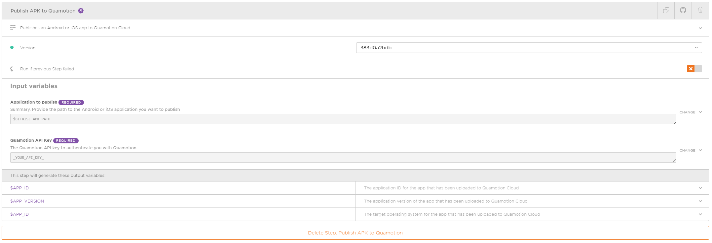

# Publish app to Quamotion Cloud

You can use this Bitrise step to publish  an Android or iOS app to [Quamotion Cloud](https://cloud.quamotion.mobi).
You can then use the Quamotion Cloud to test your iOS and Android apps.

## What this step does

This step publishes an Android or iOS app you've built with Bitrise to [Quamotion Cloud](https://cloud.quamotion.mobi).

Once you've published your app to Quamotion Cloud, you can test your app on various Android and iOS devices hosted by Quamotion.



This step takes two parameters:
- Your Quamotion API key
- The path to the app you want to publish

## Adding this step to your Bitrise workflow
To use this step, follow these steps:

1. Open your workflow in Bitrise
2. Click on the `bitrise.yml` tab in the upper-right corner of your screen
3. Copy and paste the following code in your Bitrise workflow to add this step:

```
- git::https://github.com/quamotion/bitrise-step-publish-app-to-quamotion-cloud@master:
    title: Publish APK to Quamotion
    inputs:
    - quamotion_api_key: _YOUR_API_KEY_
    - app_path: $BITRISE_APK_PATH
```

4. Save your workflow by clicking __CTRL + S__

